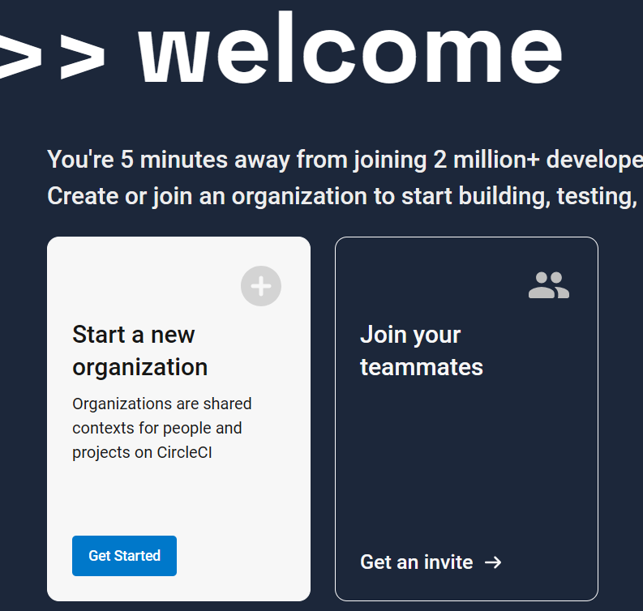
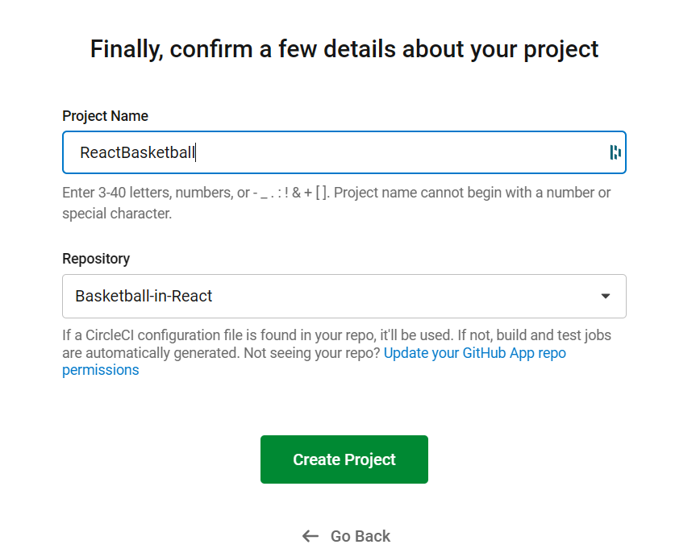

# DevOps Platformen Anwenden

Aufgabe für das Modul M324. Abgabe am 22.05.2024.

## circleCI 

CircleCI ist eine CI/CD-Plattform, die auf der Cloud basiert und automatisierte Builds, Tests und Bereitstellungen ermöglicht. Es bietet Integrationen mit verschiedenen Tools und Cloud-Diensten.

### Organisationen

CircleCI bietet eine sehr einfach möglichkeit, mit einem Team zusammenzuarbeiten. Es können Organisationen erstellt werden, in denen die Projekte verwaltet werden können. 

Dafür habe ich einfach eine Testorganisation erstellt, in der ich ein Projekt erstellt habe.

### Projekte

