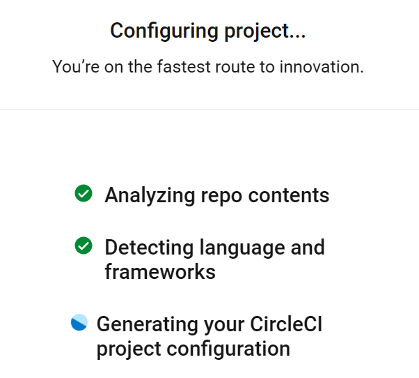
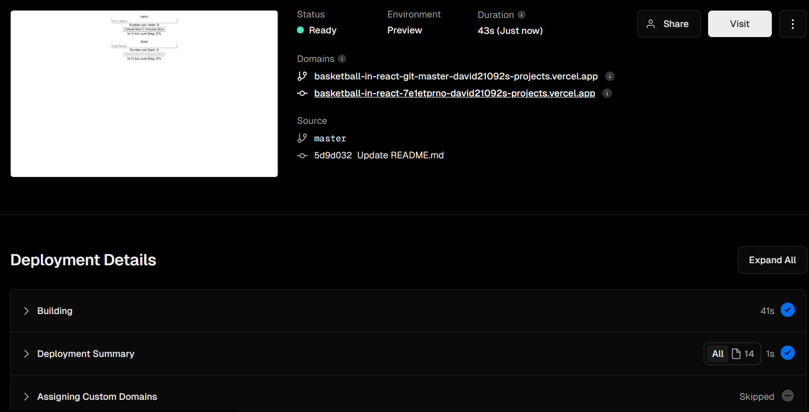

# DevOps Platformen Anwenden

Aufgabe für das Modul M324. Abgabe am 22.05.2024.


## circleCI 

CircleCI ist eine CI/CD-Plattform, die auf der Cloud basiert und automatisierte Builds, Tests und Bereitstellungen ermöglicht. Es bietet Integrationen mit verschiedenen Tools und Cloud-Diensten.

### Organisationen


CircleCI bietet eine sehr einfach möglichkeit, mit einem Team zusammenzuarbeiten. Es können Organisationen erstellt werden, in denen die Projekte verwaltet werden können. 

Dafür habe ich einfach eine Testorganisation erstellt, in der ich ein Projekt erstellt habe.

### Projekte


Ich habe für dieses Projekt ein altes Projekt von mir genommen, welches ich auf GitHub veröffentlicht habe.



Die Erstellung eines Projektes ist sehr einfach, da jegliche Einstellungen automatisch erkannt werden. 

```yaml
# Couldn't automatically generate a config from your source code.
# This is a generic template to serve as a base for your custom config
# See: https://circleci.com/docs/configuration-reference
version: 2.1
jobs:
  test:
    docker:
      - image: cimg/base:stable
    steps:
      - checkout
      # Replace this with a real test runner invocation
      - run:
          name: Run tests
          command: echo 'replace me with real tests!' && false
  build:
    docker:
      - image: cimg/base:stable
    steps:
      - checkout
      # Replace this with steps to build a package, or executable
      - run:
          name: Build an artifact
          command: touch example.txt
      - store_artifacts:
          path: example.txt
  deploy:
    docker:
      - image: cimg/base:stable
    steps:
      # Replace this with steps to deploy to users
      - run:
          name: deploy
          command: '#e.g. ./deploy.sh'
workflows:
  example:
    jobs:
      - test
      - build:
          requires:
            - test
      - deploy:
          requires:
            - test
```

Dieses ist die generierte Konfiguration, welche man dann noch anpassen kann. Dies könnte man verändern, um die App dann auf AWS oder ändliches zu deployen. 

## Vercel

Für das simple deployment habe ich Vercel verwendet. Vercel ist eine Serverless-Plattform, die es ermöglicht, statische Webseiten und Serverless-Funktionen zu hosten.



Die Webseite ist nun gehostet: https://basketball-in-react.vercel.app/. 