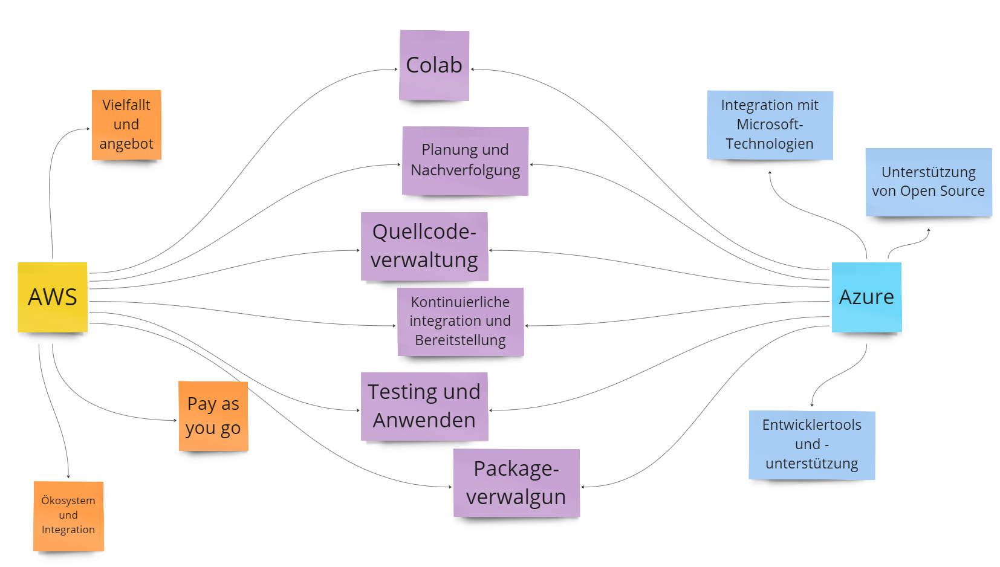

# DevOps Platformen

Aufgabe für das Modul M324. Abgabe am 15.05.2024.

## AWS und Azure im Vergleich

## Alternative DevOps-Plattformen

| Alternative          | Themenabdeckung                                                                                                                                                            | Kosten                                                                             |
|----------------------|----------------------------------------------------------------------------------------------------------------------------------------------------------------------------|------------------------------------------------------------------------------------|
| 1. GitHub Actions    | GitHub Actions bietet Funktionen für CI/CD, Issue-Tracking und Zusammenarbeit. Es ermöglicht die Automatisierung von Workflows direkt in Ihrem GitHub-Repository.           | Kostenlos für öffentliche Repositories, Preismodell für private Repositories      |
| 2. Jenkins           | Jenkins ist eine Open-Source-Plattform für CI/CD, die eine umfangreiche Integration mit verschiedenen Tools und Frameworks bietet. Es ermöglicht die Automatisierung von Builds, Tests und Bereitstellungen.                     | Kostenlos (Open Source), Unternehmensunterstützung verfügbar                      |
| 3. GitLab            | GitLab bietet eine integrierte CI/CD-Pipeline sowie Funktionen für Issue-Tracking, Code-Reviews und Zusammenarbeit. Es ermöglicht eine End-to-End-Entwicklungsplattform.  | Kostenlose Version für Open Source und kleine Teams, verschiedene Preismodelle    |
| 4. Bitbucket         | Bitbucket bietet Git-Repository-Hosting, Pull-Requests und CI/CD-Integrationen. Es ist eng mit anderen Atlassian-Tools wie Jira und Confluence integriert.                | Kostenlos für bis zu 5 Benutzer, Preismodell für grössere Teams                  |
| 5. CircleCI          | CircleCI ist eine CI/CD-Plattform, die auf der Cloud basiert und automatisierte Builds, Tests und Bereitstellungen ermöglicht. Es bietet Integrationen mit verschiedenen Tools und Cloud-Diensten.                                      | Kostenloses Starterpaket, Preismodell für grössere Teams                          |
| 6. Travis CI         | Travis CI ist eine gehostete CI/CD-Plattform, die auf GitHub-Repositories spezialisiert ist. Es ermöglicht automatisierte Builds, Tests und Bereitstellungen direkt aus Ihren Repositories.                                                     | Kostenloses Kontingent für Open Source, Preismodell für private Repositories     |
| 7. Bamboo            | Bamboo ist eine CI/CD-Plattform von Atlassian, die eine nahtlose Integration mit Jira, Bitbucket und Confluence bietet. Es ermöglicht automatisierte Builds, Tests und Bereitstellungen in einer integrierten Umgebung.               | Preismodell basierend auf der Anzahl der Build-Agenten und Benutzer              |
| 8. TeamCity          | TeamCity ist eine Continuous-Integration- und Bereitstellungsplattform von JetBrains. Es bietet eine umfangreiche Unterstützung für verschiedene Programmiersprachen und Frameworks sowie Integrationen mit anderen Tools und Diensten.  | Kostenlose Version für kleine Teams, Preismodell für grössere Teams              |
| 9. Trello  | Trello bietet eine flexible Plattform für das Projektmanagement, die das Erstellen von Boards, Listen und Karten ermöglicht. Es unterstützt die Zusammenarbeit, Aufgabenverfolgung, Terminplanung und Dokumentation von Projekten.	    | Kosten variieren je nach gewähltem Plan, kostenlose Basisversion verfügbar, Premium-Pläne mit erweiterten Funktionen und Integrationen |
| 10. Raygun.io       | Raygun.io ist ein Fehlerverfolgungs- und Überwachungsdienst, der die Identifizierung und Behebung von Softwarefehlern erleichtert. Es bietet Funktionen für die Fehlerverfolgung, Überwachung und Analyse von Anwendungsleistungsdaten.  | Preismodell basierend auf der Anzahl der Fehler und Benutzer                      |

### Abdeckung von DevOps-Plattformen
1. **Continuous Integration (CI)**: Automatisierte Builds, Tests und Codeintegration.
2. **Continuous Deployment (CD)**: Automatisierte Bereitstellung von Anwendungen in verschiedenen Umgebungen.
3. **Version Control**: Verwaltung und Nachverfolgung von Codeänderungen.
4. **Issue-Tracking**: Nachverfolgung von Fehlern, Aufgaben und Anforderungen.
5. **Zusammenarbeit**: Funktionen für die Teamarbeit und Kommunikation.
6. **Integrationen**: Unterstützung für die Integration mit anderen Tools und Diensten.
ss
